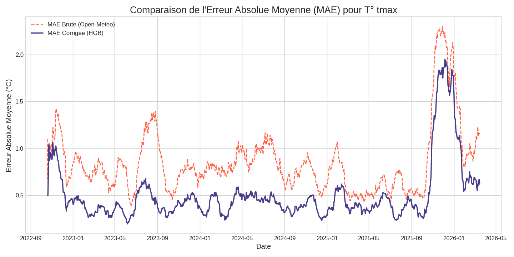
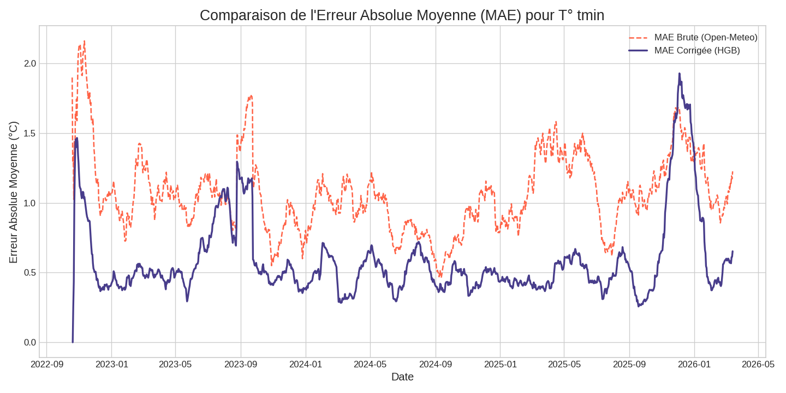
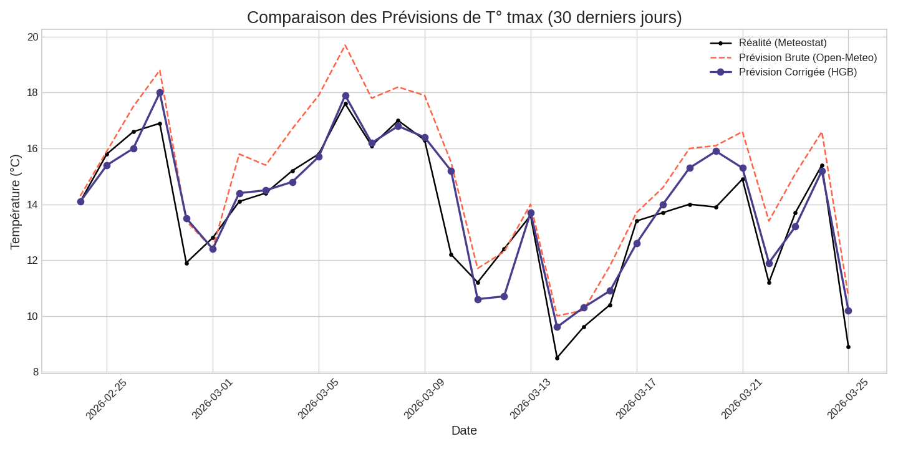
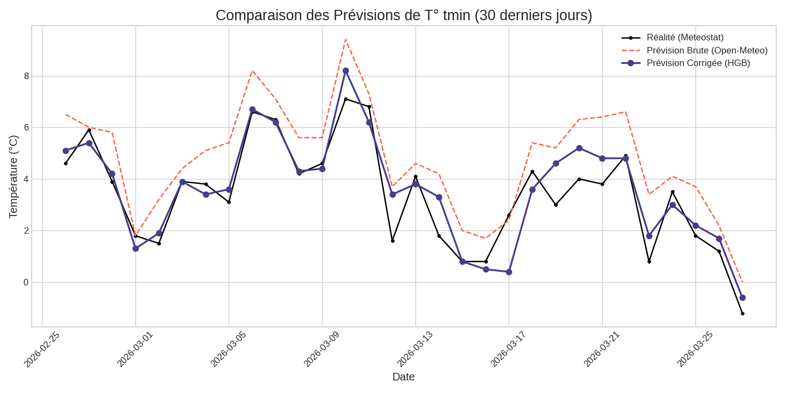

# 🌦️ Bias-Corrector Weather — Prédictions météo locales corrigées automatiquement


Ce projet corrige automatiquement les **prévisions météo J+1** d’une API publique (Open-Meteo) pour une localisation donnée. Il apprend à annuler le **biais systématique local** en analysant les erreurs passées grâce à un modèle `HistGradientBoostingRegressor`.

Le modèle s'appuie sur des features temporelles, radiatives et surtout **décalées (mémoire des erreurs passées)** pour affiner sa correction. Le pipeline tourne chaque jour grâce à GitHub Actions et met à jour les données, les modèles et les graphiques de performance sans aucune intervention manuelle.

---
## 📊 Résultats Visuels

Voici la performance du modèle, mise à jour quotidiennement.

### Amélioration de la Précision (MAE)

Ce graphique montre l'erreur absolue moyenne (MAE) sur une fenêtre glissante de 30 jours.

* **Température Minimale :** On observe une **réduction significative et constante de l'erreur** grâce au modèle corrigé (courbe bleue).
* **Température Maximale :** Le modèle a intelligemment appris à ne pas dégrader la prévision originale, son erreur résiduelle étant principalement aléatoire et non un biais systématique.

**Température Maximale**


**Température Minimale**


### Comparaison sur les 30 Derniers Jours

Ce graphique montre la performance du modèle au jour le jour sur la période récente.

**Température Maximale**


**Température Minimale**

---

## ✨ Fonctionnalités

-   📥 Téléchargement automatique des **prévisions J+1** chaque soir.
-   🌡️ Récupération automatique des **observations réelles** via Meteostat le lendemain.
-   🧠 Réentraînement quotidien d’un **modèle HGB** pour corriger le biais local.
-   🧩 **Feature Engineering Avancé** : création de variables de saisonnalité, radiatives (soleil, nuages) et de **mémoire** (erreurs J-1, moyenne glissante...).
-   📊 **Génération automatique de graphiques** de performance avec Matplotlib.
-   🔮 Prédiction corrigée publiée dans `last_prediction.json`.
-   ☁️ Automatisation complète via GitHub Actions (aucun PC à laisser allumé).
-   ⚡ **Seed initial avec 3 ans d'historique** (prévisions Open-Meteo et observations Meteostat).

---

## 🗂️ Structure du projet

```
bias-corrector-weather/
├─ data/
│  ├─ forecasts.csv           # prévisions brutes historiques et quotidiennes
│  ├─ observations.csv        # observations réelles
│  └─ predictions.csv         # historique des prédictions corrigées
├─ models/
│  ├─ hgb_tmax.joblib         # modèle de correction Tmax
│  └─ hgb_tmin.joblib         # modèle de correction Tmin
├─ plots/
│  ├─ mae_comparison_tmax.png # graphiques de performance auto-générés
│  └─ ...
├─ src/
│  ├─ config.py               # coordonnées, timezone, chemins
│  ├─ seed_history.py         # seed 3 ans d'historique
│  ├─ fetch_forecast.py       # prévision J+1 quotidienne
│  ├─ fetch_obs.py            # observation J-1 quotidienne
│  ├─ features.py             # génération des features (saison, mémoire...)
│  ├─ train.py                # entraînement HGB sur les erreurs
│  ├─ predict.py              # prédiction corrigée J+1
│  └─ plots.py                # génération des graphiques
├─ .github/workflows/
│  └─ daily.yml               # automatisation GitHub Actions (2 runs/jour)
├─ README.md
└─ requirements.txt
```

---

## 🚀 Installation locale

1.  Clone le repo :
    ```bash
    git clone [https://github.com/A-Jeaugey/bias-corrector-weather.git](https://github.com/A-Jeaugey/bias-corrector-weather.git)
    cd bias-corrector-weather
    ```

2.  Crée un environnement virtuel et active-le :
    ```bash
    python -m venv .venv
    # Windows: .venv\Scripts\activate | macOS/Linux: source .venv/bin/activate
    ```

3.  Installe les dépendances :
    ```bash
    pip install -r requirements.txt
    ```

---

## 🧠 Seed initial (3 ans d'historique)

Avant de lancer la machine, on génère un historique de données :
```bash
python src/seed_history.py
```

Ce script :
-   Télécharge 3 ans de l'**archive de prévisions historiques d'Open-Meteo**.
-   Télécharge 3 ans d’observations réelles via **Meteostat**.
-   Remplit `data/forecasts.csv` et `data/observations.csv`.

---

## 🛠️ Entraînement et prédiction en local

```bash
# Entraîne les modèles sur tout l'historique
python src/train.py

# Applique la correction sur la dernière prévision disponible
python src/predict.py

# Génère les graphiques de performance
python src/plots.py
```

---

## 🌀 Pipeline quotidien automatisé (GitHub Actions)

Le fichier `.github/workflows/daily.yml` automatise le tout :

| Heure Paris | Étape | Script(s) lancé(s) |
| :--- | :--- | :--- |
| 18:05 | Récupération de la prévision J+1 | `fetch_forecast.py` |
| 23:30 | Observation + Entraînement + Prédiction + Graphes | `fetch_obs.py` + `train.py` + `predict.py` + `plots.py` |

Les fichiers modifiés (`data/`, `models/`, `plots/`, `last_prediction.json`) sont automatiquement commités par le bot GitHub.

---

## 📈 Évaluation

À chaque entraînement, `train.py` évalue la performance du modèle sur les 15 derniers jours et l'affiche en comparaison de la prévision brute :

```
--- Métriques T° Min (sur 15 jours) ---
  🌡️ MAE Brute (Open-Meteo): 1.40 °C
  ✨ MAE Corrigée (HGB):   0.92 °C
  📊 Amélioration:           +34.3 %
```
👉 **MAE** = Erreur Absolue Moyenne. Un chiffre plus bas est meilleur.

---

## 🧪 Technologies et Concepts

-   **Données** : Open-Meteo, Meteostat (lib Python officielle)
-   **Features** : Saisonnalité (`doy_sin`, `doy_cos`), météo (`pluie`, `vent`, `radiation`...) et **mémoire des erreurs passées** (`erreur J-1`, `moyenne glissante sur 7j`...).
-   **Modèle** : `HistGradientBoostingRegressor` (scikit-learn)
-   **Automatisation** : GitHub Actions (2 crons/jour)
-   **Visualisation** : Matplotlib
-   **Langage** : Python 3.11

---

## 🌟 Pistes d’amélioration

-   Entraîner des modèles quantiles pour afficher une **marge d'incertitude**.
-   Corriger aussi la pluie / le vent avec des modèles de classification/régression dédiés.
-   Déployer une petite page web (Streamlit, Flask) qui lit `last_prediction.json` et affiche les graphiques.

---

## 📝 Licence

Projet libre à usage pédagogique et personnel. Sources de données :
-   [Open-Meteo](https://open-meteo.com/) (gratuite et sans clé)
-   [Meteostat](https://meteostat.net/) (libre & académique)

---
### Apprentissage et Utilisation de l'IA
Au-delà de l'objectif de modélisation météo, ce projet a également été un terrain d'expérimentation pour l'utilisation d'assistants IA. L'un de mes buts était d'apprendre à les intégrer dans un workflow de développement comme un outil de *pair programming* : pour générer du code de base, déboguer, ou encore pour rédiger la documentation. Je suis cependant resté le pilote du projet, en charge de la logique, de l'architecture et des décisions finales.